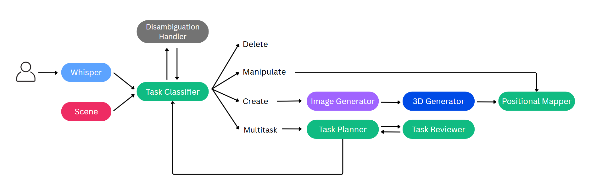

# VoiceTo3D - VR Interaction System
**VoiceTo3D** is a voice-based interaction system for virtual reality (VR) environments, built with A-Frame. It allows users to create and manipulate 3D objects in immersive scenes using only natural language commands.

## Quickstart
1. Clone the repository:
    ```
    git clone https://github.com/luciayn/VoiceTo3D-VR.git
    ```
2. Install Python dependencies:
    ```
    pip install -r requirements.txt
    ```
3. Run the backend:
    ```
    cd backend
    python main.py
    ```
4. Start a local server for the frontend:
    ```
    cd frontend
    python -m http.server 8080
    ```
5. Open app in browser:
    ```
    http://localhost:8080/app.html
    ```

## Architecture
**VoiceTo3D** integrates speech recognition, large language models (LLMs), image generation, and 3D object rendering into a single pipeline.
It also handles ambiguous references by combining language understanding with direct user input (e.g., pointing in VR).

The system uses the following models:
- **[Whisper-small](https://huggingface.co/openai/whisper-small)** – for automatic speech recognition (ASR).
- **[Qwen2.5-72B-Instruct-AWQ](https://huggingface.co/Qwen/Qwen2.5-72B-Instruct-AWQ)** – for natural language understanding and task decomposition.
- **[Stable Diffusion 2](https://github.com/Stability-AI/stablediffusion)** – for generating object images.
- **[BLIP-VQA-base](https://huggingface.co/Salesforce/blip-vqa-base)** – for extracting visual attributes.
- **[Hunyuan3D-2](https://github.com/Tencent-Hunyuan/Hunyuan3D-2)** – for 3D object modeling.



### Example Use Case
The following image shows how VoiceTo3D handles different interactions, highlighting its ability to create, manipulate and disambiguate objects in VR scenes:


## Project Structure
Overview of the project organization:
```
<root directory>
├── backend/
│   ├─  color_extractor.py       # Extract color from images
│   ├── html_template.py         # HTML to visualize glb model
│   ├── image_to_3D.py           # Convert images to 3D
│   ├── main.py                  # Backend entrypoint
│   ├── object_definition.py     # Define object properties
│   ├── pipelines.py             # Task pipelines
│   ├── qwen_model.py            # Qwen model
│   ├── task_classifier.py       # Classify user queries
│   ├── task_divider.py          # Split tasks into subtasks
│   ├── text_to_image.py         # Generate images from text
│   └── whisper.py               # Speech-to-Text processing
├── data/                    
│   └── models.json              # Model metadata
├── docs/
│   ├── architecture.png         # System architecture diagram
│   └── example.png              # Interaction example
├── frontend/                    
│   ├── js/
│   │   ├── audio-processor.js   # Audio input
│   │   ├── audio.js             # Audio logic
│   │   ├── environment.js       # VR Environment setup
│   │   ├── joystick.js          # Joystick controls
│   │   ├── main.js              # Main app logic
│   │   ├── models.js            # Load 3D models
│   │   └── websocket.js         # Websocket client
│   ├── app.html                 # Frontend entrypoint
│   └── styles.css               # Frontend styles
├── html/                 # Pre-rendered object HTML files
├── images/               # Image assets
├── models/               # 3D model files (.glb)
├── requirements.txt      # Python dependencies
├── LICENSE               # License file
└── README.md             # Project documentation (this file)
```

## License
This project is licensed under the MIT License. See [LICENSE](LICENSE) for details.